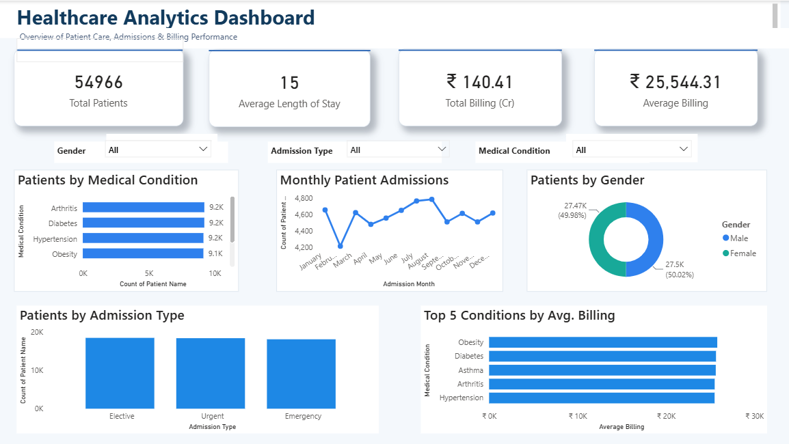
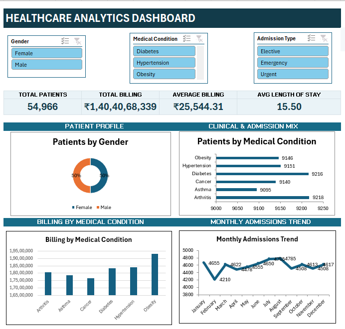
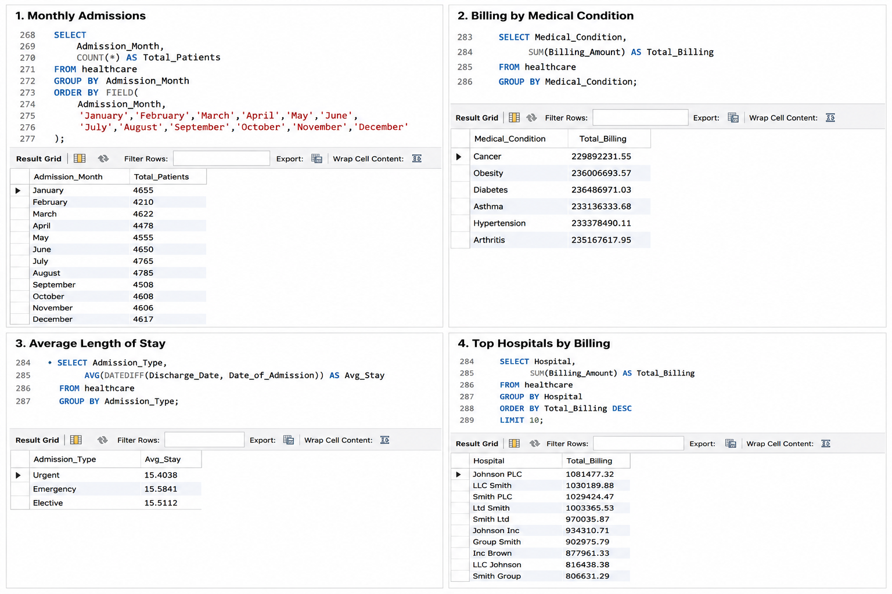
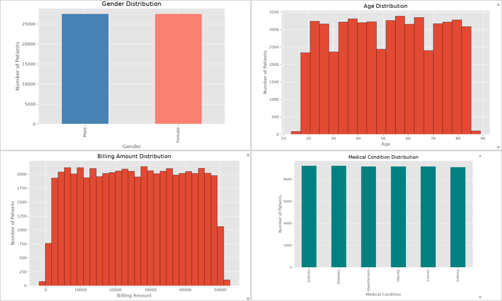

<div align="center">

# Healthcare Analytics

### End-to-End Data Analytics Project using Excel, SQL, Python and Power BI

Analyzing patient records, billing patterns, and hospital operations to surface insights that support better healthcare decision-making.


</div>

---

## Table of Contents

- [Project Overview](#project-overview)
- [Objectives](#objectives)
- [Tech Stack](#tech-stack)
- [Folder Structure](#folder-structure)
- [Data Pipeline](#data-pipeline)
- [Key Insights](#key-insights)
- [Dashboard Features](#dashboard-features)
- [SQL Highlights](#sql-highlights)
- [Python Highlights](#python-highlights)
- [DAX Highlights](#dax-highlights)
- [Business Questions Answered](#business-questions-answered)
- [Skills Demonstrated](#skills-demonstrated)
- [Project Screenshots](#project-screenshots)
- [Future Improvements](#future-improvements)
- [Installation](#installation)
- [Requirements](#requirements)
- [Author](#author)

---

## Project Overview

This project walks through a complete healthcare analytics workflow, starting from raw data and ending with an interactive Power BI dashboard. Along the way, the data was cleaned in Python, queried and structured in SQL, and explored to understand patient demographics and billing behavior.

The idea was to build something close to what a hospital analytics team would actually work with — a clean pipeline from raw records to a dashboard that stakeholders can use without needing to open a single spreadsheet.

---

## Objectives

- Clean and organize raw patient and billing data
- Use SQL to answer core business questions with structured queries
- Explore patient demographics, admissions, and billing patterns in Python
- Engineer features that make reporting and analysis easier downstream
- Build an interactive Power BI dashboard with KPIs and DAX measures
- Present the findings in a way that is easy for non-technical stakeholders to use

---

## Tech Stack

| Layer | Tools Used |
|---|---|
| Data Storage & Staging | Excel |
| Database & Querying | MySQL |
| Data Cleaning & Analysis | Python (Pandas, NumPy, Matplotlib) |
| Visualization | Power BI, DAX |
| Development Environment | Jupyter Notebook |

---

## Folder Structure

```
Healthcare_Analytics/
│
├── Data/
│   ├── raw/                       Original, untouched dataset
│   ├── cleaned/                   Cleaned dataset ready for analysis
│   └── data_description.md        Column-level data dictionary
│
├── SQL/
│   ├── schema.sql                 Table structure and relationships
│   └── business_queries.sql       Core business question queries
│
├── Python/
│   ├── 01_Data_Understanding.ipynb
│   ├── 02_Data_Cleaning.ipynb
│   ├── 03_EDA.ipynb
│   └── 04_Feature_Engineering.ipynb
│
├── Excel/
│   └── Healthcare_Analytics.xlsx  Working Excel file
│
├── PowerBI/
│   └── Healthcare_Analytics.pbix  Power BI dashboard
│
├── Screenshots/
│   ├── sql_queries.png
│   ├── python_eda.png
│   ├── powerbi_dashboard.png
│   └── excel_dashboard.png
│
├── requirements.txt
└── README.md
```

---

## Data Pipeline


---

## Key Insights

<details>
<summary>Click to expand</summary>

<br>

- Billing amounts vary significantly across medical conditions, with chronic conditions such as diabetes and cancer showing noticeably higher average billing than short-term illnesses.
- Patient volume is fairly balanced across gender, though a few conditions show a skew toward one group.
- Blood type distribution roughly matches real-world population patterns, with O+ and A+ being the most common among admitted patients.
- Monthly billing shows seasonal spikes, likely linked to increases in admission volume during certain months.
- A small group of patients accounts for a disproportionately large share of total billing, which is worth monitoring for cost management.
- Average patient age varies by medical condition, with some conditions more concentrated in older age groups.

</details>

---

## Dashboard Features

**KPI Cards**

| KPI | Description |
|---|---|
| Total Patients | Total unique patients in the dataset |
| Total Billing | Sum of all billing amounts |
| Average Billing | Average billing amount per patient |
| Average Age | Average age across all patients |

**Visualizations**

- Billing by Medical Condition
- Patient Gender Distribution
- Blood Type Distribution
- Monthly Billing Trend

**Interactive Features**

- Slicers for medical condition, gender, and admission month
- Cross-filtering across all visuals
- DAX measures that update dynamically based on slicer selection

---

## SQL Highlights

SQL formed the core analytical layer before the data moved into Python and Power BI. It was used for:

- **Data exploration** — profiling row counts, nulls, and distinct values
- **Business questions** — writing targeted queries to answer specific stakeholder questions
- **Aggregations** — totals, averages, and counts across patient groups
- **Filtering** — isolating records by condition, admission type, and billing range
- **Grouping** — grouping patients by condition, gender, and blood type
- **Joins** — combining patient, billing, and admission tables into a single view
- **Analytical queries** — window functions and subqueries for ranking and trend analysis

Files: `schema.sql`, `business_queries.sql`

---

## Python Highlights

| Notebook | Purpose |
|---|---|
| `01_Data_Understanding.ipynb` | Initial inspection of the dataset — shape, data types, missing values, and summary statistics |
| `02_Data_Cleaning.ipynb` | Handling missing values, fixing data types, removing duplicates, and standardizing inconsistent entries |
| `03_EDA.ipynb` | Exploratory analysis using Pandas and Matplotlib to look for patterns in billing, demographics, and admissions |
| `04_Feature_Engineering.ipynb` | Creating derived columns such as age groups, billing categories, and length of stay for deeper analysis |

Core libraries used: Pandas, NumPy, Matplotlib

---

## DAX Highlights

Key DAX functions used to build measures in the Power BI dashboard:

`SUM`, `COUNTROWS`, `CALCULATE`, `FILTER`, `DIVIDE`, `DISTINCTCOUNT`, `RANKX`, `VAR`, `RETURN`, `SWITCH`, `IF`, `SELECTEDVALUE`, `HASONEVALUE`, `COALESCE`

These were combined to build measures such as average billing per condition, dynamic KPI titles based on slicer selection, ranked conditions by billing amount, and safe division handling for ratio-based metrics.

---

## Business Questions Answered

- Which medical conditions generate the highest total and average billing?
- How is the patient population distributed across gender and blood type?
- What does the monthly billing trend look like across the year?
- Which conditions have the highest patient volume?
- How does average age vary across different medical conditions?
- Are there any billing outliers worth flagging for review?

---

## Skills Demonstrated

- Data cleaning and preprocessing with Python
- Writing structured, multi-table SQL queries
- Exploratory data analysis and statistical summarization
- Feature engineering for analytical readiness
- DAX measure design for dynamic reporting
- Dashboard design for non-technical stakeholders
- Structuring an end-to-end analytics project

---

## Project Screenshots

**Power BI Dashboard**



**Excel Dashboard**



**SQL Queries**



**Python EDA**



---

## Future Improvements

- Add a Hospital Billing Analysis page (Page 2) with deeper cost breakdowns
- Implement advanced time intelligence DAX measures (YoY, MoM, running totals)
- Explore predictive analytics for billing and length-of-stay forecasting
- Apply machine learning models to predict patient risk categories

---


---

## Requirements

`requirements.txt`

```
pandas
numpy
matplotlib
jupyter
openpyxl
```

---

## Author

**Prajwal Naik**

GitHub: [github.com/prajwalnaik98](https://github.com/prajwalnaik98)<br>
LinkedIn: [linkedin.com/in/prajwal-naik-9362b0327](https://www.linkedin.com/in/prajwal-naik-9362b0327)
